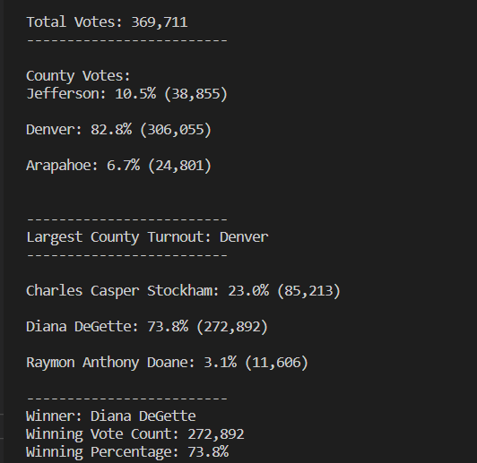

# Election_Analysis
## Overview
A Colorado Board of Elections employee has given you the following task to complete the election audit of a recent local congressional election.

* Calculate the total number of votes cast.
* Get a complete list of candidates who received votes.
* Calculate the total number of votes each candidate received.
* Calculate the percentage of votes each candidate won.
* Determine the winner of the election based on popular vote
* Calculate the voter turnout for each county.
* Calculate the percentage of votes from each county out of the total.
* Determine the county with the highest turnout.

## Election-Audit Results

## Conclusion:
